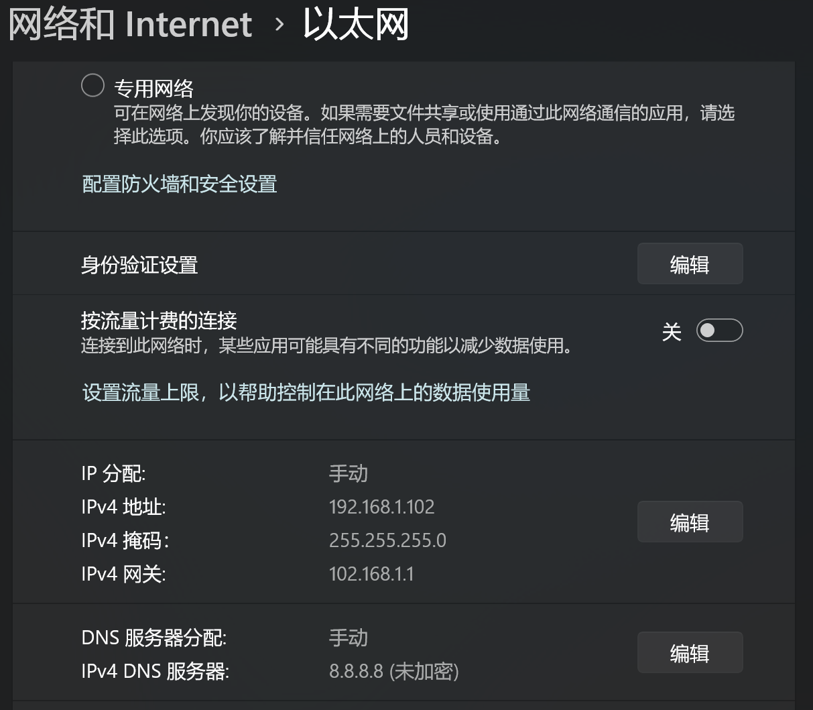
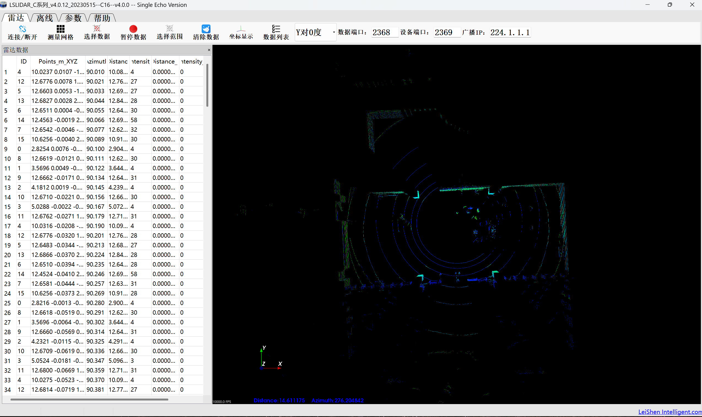
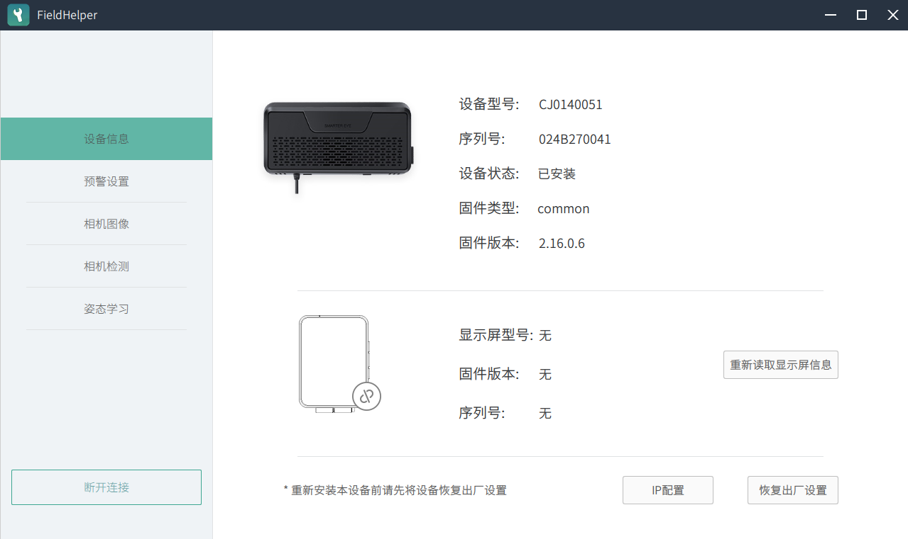
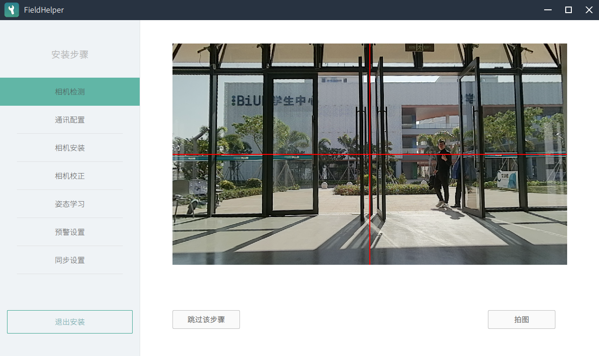

# 第9组_Week6_敬钰娟_实车硬件巡检与相机标定任务报告

## 一、前置准备工作

1.关闭 Windows 系统的防火墙，避免设备连接被阻断

2.关闭车辆工控机的 Ubuntu 系统，防止后续传感器连接出现IP 冲突

3.准备好所需工具：Windows 端的 LSLIDAR 上位机（用于激光雷达检测）、FieldHelper 工具（用于双目相机检测）

4.检查网线连接与车辆供电状态，确保硬件链路正常

## 二、任务 1：Windows 上位机初步检测

### 2.1 激光雷达（LiDAR）检测

#### 2.1.1 Windows 静态 IP 配置

进入 “网络和 Internet 设置”，将以太网的 IP 分配改为手动，配置参数为：
IP 地址：192.168.1.102
子网掩码：255.255.255.0
网关：192.168.1.1
首选 DNS：8.8.8.8
配置完成后，需确认 IP 已成功变更。

IP配置完成截图:

#### 2.1.2 上位机连接与点云检查

打开 LSLIDAR 上位机（确保车辆工控机已关机），点击 “连接” 按钮，检查实时点云是否覆盖 360° 环境，且画面无卡顿、无断连。可通过鼠标拖动调整视角、滚轮缩放画面辅助查看。

【截图】激光雷达点云画面：

### 2.2 双目相机（Camera）检测

#### 2.2.1软件连接

打开 FieldHelper 工具，选择 “离线登录” 后点击 “连接设备”，输入设备 IP 地址 192.168.1.251 完成连接。

#### 2.2.2 相机画面检查

确认左、右目相机视野正常，无黑屏、无明显卡顿，且设备状态显示 “已安装”。
【截图】双目相机连接成功界面：

【截图】双目相机画面：

后续操作：
任务 1 完成后，需对整车执行断电→重新上电操作，确保 CAN 卡完全启动，避免影响后续任务。

## 三、任务 2：全传感器健康度巡检

### 3.1 宿主机（Docker 外）底层通讯巡检

#### 3.1.1 CAN 总线检测

在 Ubuntu 终端执行命令candump can0，验证终端是否有持续跳动的数据帧，且包含至少两种不同的 CAN ID。
【截图】CAN 总线数据输出界面：

#### 3.1.2 网络连通性 Ping 测试

分别执行以下命令，验证传感器的网络连通性（需确保无丢包、延迟较低）：
激光雷达：ping 192.168.1.200
双目相机：ping 192.168.1.251
【截图】激光雷达 Ping 测试结果：

【截图】双目相机 Ping 测试结果：

### 3.2 Apollo 系统（Docker 内）模块与通道校验

#### 3.2.1 Apollo 模块启动

启动 Dreamview 交互界面，在 “模块控制” 页面依次打开 GPS、IMU、定位、CAN 总线、激光雷达、相机、超声波、毫米波模块，确认所有模块无报错启动成功。
【截图】Apollo 模块启动状态：

#### 3.2.2 数据通道频率校验

进入 Docker 环境（执行/apollo/docker/scripts/dev_into.sh），通过rostopic hz命令验证数据频率：
激光雷达通道/apollo/sensor/lidar16/PointCloud2：目标频率约 10Hz（需稳定）
双目相机通道/apollo/sensor/camera/obstacle/front_6mm：需保持稳定数据流（无断连）
【截图】激光雷达频率检测结果：

【截图】相机频率检测结果：

#### 3.2.3 数据内容检查

执行rostopic echo [topic_name]命令，验证各通道数据输出：
超声波雷达通道/apollo/sensor/ultrasonic_radar：需输出 8-12 路测距数值

毫米波雷达通道/apollo/sensor/conti_radar：需回传障碍物信息

组合导航通道/apollo/sensor/gnss/best_pose：需有完整定位内容

惯导（IMU）通道/apollo/sensor/gnss/imu：需实时刷新三轴加速度、角速度

底盘反馈通道/apollo/canbus/chassis：需与实车车速、转向角同步

定位结果通道/apollo/localization/pose：需有稳定定位输出

## 五、问题与解决

记录任务中出现的问题及处理情况：
问题现象：激光雷达无点云
出现环节：LiDAR 检测
解决方法：检查 IP 配置并重启上位机
解决结果：已解决

## 六、总结

### 本次任务核心完成情况

已完成 Windows 上位机与激光雷达、双目相机的基础连通性验证，通过静态 IP 配置实现设备连接；完成宿主机底层 CAN 总线、网络连通性检测，Apollo 系统模块启动及数据通道频率、内容的初步校验；若需标定则完成双目相机的参数配置与姿态学习，确保设备状态正常。

### 未解决问题

暂未出现未解决问题。

### 后续改进建议

建议在执行任务前提前确认工具版本与设备 IP 的匹配性；针对传感器断连问题，可增加 “先断电重启设备再重试” 的前置步骤。
